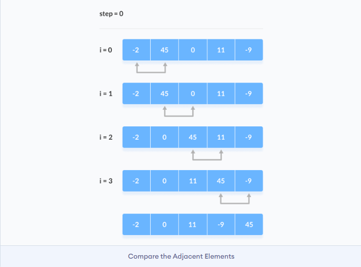
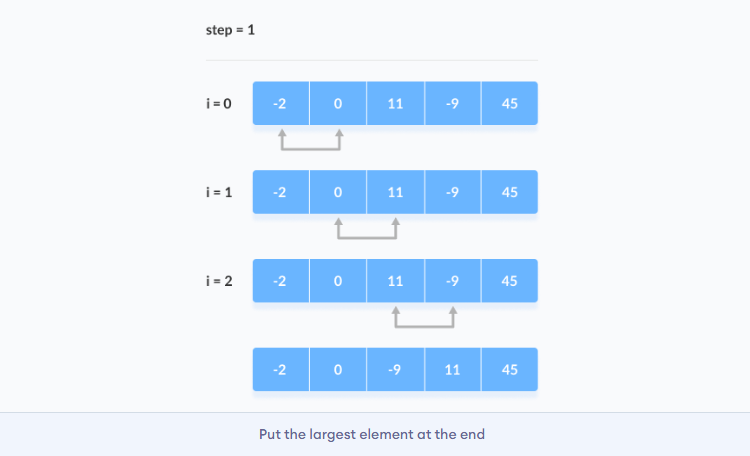
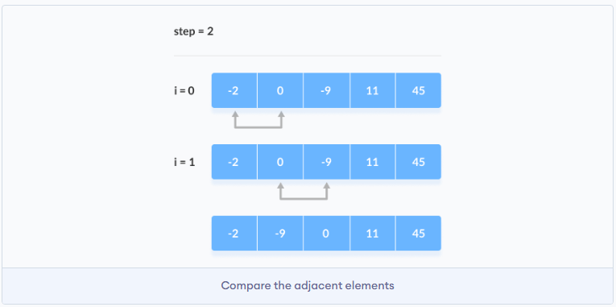
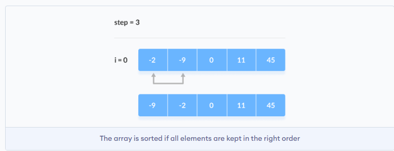

# Алгоритмы

## Бинарный поиск (binary search)

**Пример задачи: Найти позицию для вставки**    
Дано отсортированное множество различных целых чисел и целевое значение, вернуть индекс, если цель найдена. Если нет,
вернуть индекс, где бы он был, если бы он был вставлен по порядку  
Необходимо написать алгоритмы обладающий O(log n) сложностью во время выполнения

**Пример 1:**  
Ввод: nums = [1,3,5,6], target = 5
Вывод: 2

**Пример 2:**  
Ввод: nums = [1,3,5,6], target = 2
Вывод: 1

**Пример 1:**  
Ввод: nums = [1,3,5,6], target = 7
Вывод: 4

**Пример решения:**  
nums = [1,3,5,6], target = 5  
Можно пройти по всему массиву слева направо, перебирая каждый элемент, пока не наткнемся на число, которое больше либо
равно целевому. Тогда возвращаем этот элемент. Основная проблема, что сложность O(n), то есть это линейное решение

Логарифмическая сложность в решении:  
Логарифм это когда на каждой итерации цикла в несколько раз уменьшается объем массива. В нашем случае на первой итерации
цикла разбиваем массив пополам и логически понимаем, что левая часть массива нам не
нужна

### Метод двух указателей

Решение: [binary_search.py](..%2Fcode%2Falgos%2Fbinary_search.py)

У нас есть два указателя левый (L) и правый (R), которые указывают на индекс в массиве и ставятся слева и справа. В
данном случае L = 0, R = 3

Вводим переменную Middle: mdl = (0+3)/2. Получаем 1 в меньшую сторону округляя.  
Далее сравниваем:

```python
nums = [1, 3, 5, 6]
target = 5

l = 0
r = len(nums) - 1
mdl = (l + r) // 2
if nums[mdl] == target:
    result = mdl

if nums[mdl] < target:
    l = mdl + 1

if nums[mdl] > target:
    r = mdl - 1
``` 

И повторяем до тех пор, пока левый указатель не выйдет за правый, тогда это и будет ответом. Либо если nums[mdl] ==
target

## Пузырьковая сортировка (Bubble Sort)

Это алгоритм сортировки который сравнивает два соседних элемента между собой и меняет их местами до тех пор пока они не
будут расположены в нужном порядке

### Работа алгоритма

Например, мы хотим отсортировать элементы по возрастанию

**Первая итерация (сравнение и замена)**

1. Начинаем с первого элемента, сравнивая первый и второй элемент
2. Если первый элемент больше второго, они меняются местами
3. Теперь, сравниваем второй и третий элементы. Меняем их местами если они не упорядочены
4. Этот процесс повторяется вплоть до последнего элемента  



**Оставшиеся итерации**
Процесс повторяется для остальных итераций. После каждой итерации самый большой элемент среди неотсортированных
размещается в конце 


В каждой итерации сравнение выполняется до последнего неотсортированного элемента


Массив является отсортированным когда все неотсортированные элементы размещены в правильной позиции


Реализация на питоне:
[bubble_sort.py](..%2Fcode%2Falgos%2Fbubble_sort.py)

### Сложность алгоритма
- Временная сложность:
    Лучшее O(n)
    Худшее O(n^2)
    Среднее O(n^2)
- Сложность по памяти O(1)